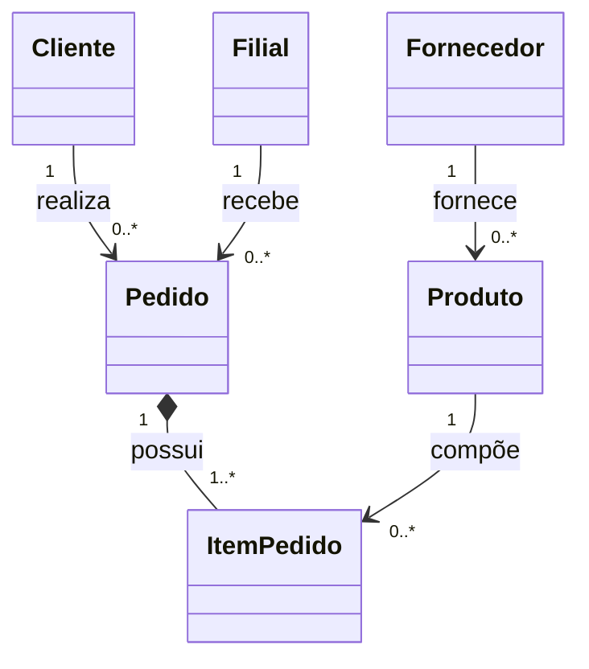
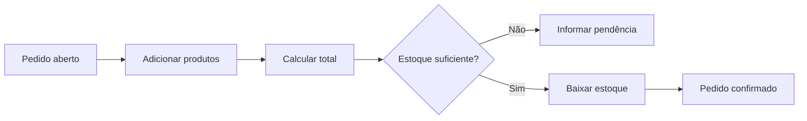

# Diagramas

Os arquivos `.puml` podem ser abertos no VSCode com uma extensão PlantUML ou em qualquer ferramenta compatível.

## Relacionamentos principais

```mermaid
classDiagram
    Fornecedor "1" --> "0..*" Produto : fornece
    Cliente "1" --> "0..*" Pedido : realiza
    Filial "1" --> "0..*" Pedido : recebe
    Pedido "1" *-- "1..*" ItemPedido : possui
    Produto "1" --> "0..*" ItemPedido : compõe
```

## Fluxo de efetivação

```mermaid
flowchart LR
    A[Pedido aberto] --> B[Adicionar produtos]
    B --> C[Calcular total]
    C --> D{Estoque suficiente?}
    D -- Não --> E[Informar pendência]
    D -- Sim --> F[Baixar estoque]
    F --> G[Pedido confirmado]
```
